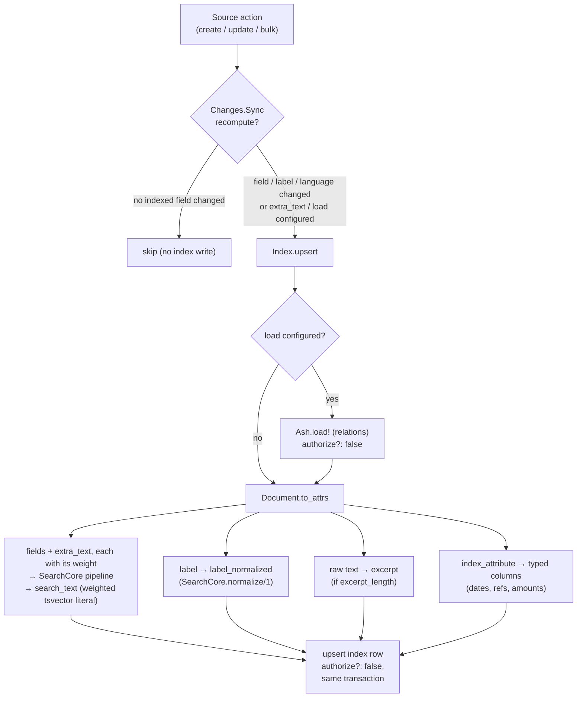
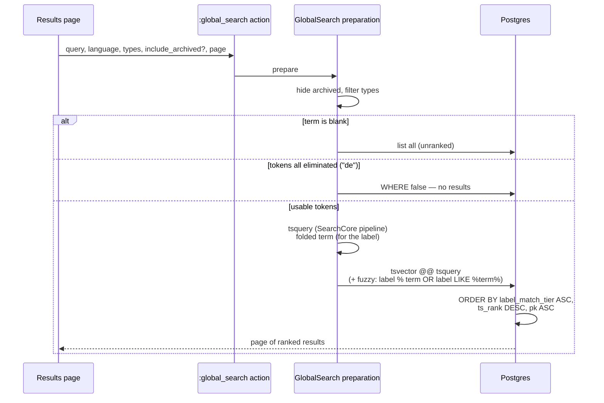

# Architecture

How search_ash works under the hood: the pipeline symmetry principle, the indexing
path, the query path, and the reconciliation story. For the upgrade steps from 0.3.x,
see [Upgrading to 0.4](upgrading-0.4.md).

## The stack, and the one principle everything follows

```
search_ash   — Ash extensions (this library)
  └── search_core   — pure text engine: tokenize → stopwords → stem → fold accents
        └── text_stemmer   — Snowball algorithms compiled to pure Elixir (33 languages)
```

**Stemming happens in Elixir, not in Postgres.** The same `SearchCore` pipeline runs
at index time (what gets stored) and at query time (what gets searched), so the two
sides can never disagree — the classic "search returns nothing because the query
wasn't stemmed the same way" bug is structurally impossible. Postgres only ever sees
pre-stemmed tokens through the `'simple'` configuration:

```sql
-- index side: search_text holds a weighted tsvector literal built in Elixir,
-- e.g.  'bl':1A 'cheval':2B 'foin':3
search_text::tsvector

-- query side: $1 is built by SearchCore.tsquery/3, same pipeline
to_tsquery('simple', $1)
```

Tokens are restricted to letters and digits, which is what makes producing that literal
in Elixir safe — there is nothing to escape. Carrying a weight per field (`:a`–`:d`) is
what lets `ts_rank` score a hit in a reference above the same hit in a body.

This is what enables **per-row languages** (each row is stemmed in its own language,
something `to_tsvector('french', …)` cannot do without one column per language) and
keeps the whole stack NIF-free.

## The two extensions

* **`SearchAsh`** (`search do … end`) — per-resource search: adds a `search_text`
  column to the resource's own table, keeps it in sync, exposes a `:search` action.
  Queries the source table, so the resource's policies apply.
* **`SearchAsh.GlobalIndex`** + **`SearchAsh.Source`** (`global_index do … end` /
  `searchable do … end`) — one cross-entity index table, one ranked `:global_search`
  action over every indexed entity type.

## Indexing path (GlobalIndex)

Every write to a source resource mirrors it into the index, synchronously, inside the
source action's transaction — a rollback takes the index write with it, so the two
tables cannot diverge.



Key properties:

* **`Index.upsert/3` is the single choke point** — the sync change, bulk
  `after_batch`, `SearchAsh.reindex/2` and `SearchAsh.reindex_one/3` all go through
  it, so `load`/`extra_text` apply everywhere without anything having to remember.
* **Internal index access is always `authorize?: false`.** Mirroring is machinery:
  the source write was already authorized, and the index's own policies answer a
  different question ("what may a user *find*"), enforced on `:global_search`.
* On destroy, `on_destroy` decides: `:remove` deletes the row, `:archive` keeps it
  flagged (`archived: true`), preserving its stored text and label columns.

## Query path (`:global_search`)



The **three branches on the term** (0.4.0):

| term | behaviour |
|---|---|
| blank / absent | list everything, unranked — a list UI before the user types |
| non-blank, no usable token (`"de"`, `"b"`) | **no results** — never the whole base |
| usable tokens | filter + rank |

The **ranking** is a composite sort:

1. `label_match_tier` — how the *normalized label* relates to the normalized query
   term (`SearchCore.normalize/1` on **both** sides, so they cannot drift): `0` exact,
   `1` starts-with, `2` contains, `3` body-only match. A row whose label *is* what the
   user typed beats a row that merely mentions it often. Rows indexed before 0.4.0
   (no `label_normalized` yet) fall to tier 3 — nothing breaks.
2. `ts_rank` over the tsvector — relevance within a tier.
3. Primary key — a deterministic tiebreaker, which is what makes pagination stable.

With **`fuzzy? true`** (opt-in, requires `pg_trgm`), the filter also accepts a
trigram-similarity or substring match on `label_normalized` (`duont` → `Dupont`,
`12` → `BL-2024-0012`), both served by one trigram GIN index. Fuzzy-only matches
carry `ts_rank` 0, so they naturally rank behind full-text matches.

## The index table

| column | filled from | role |
|---|---|---|
| `source_type` | `searchable.source_type` | entity tag (stored as string), `types` filter, tab counts |
| `source_id` | primary key, `":"`-joined | routing back to the object |
| `language` | static `language` or `language_attribute` | which stemmer indexed this row |
| `search_text` | `fields` + `extra_text`, stemmed and weighted | what the tsvector matches, and how heavily |
| `label` | `label_field` | what a result displays |
| `label_normalized` | `SearchCore.normalize/1` of `label` | ranking tiers + fuzzy matching |
| `excerpt` | raw text, truncated (`excerpt_length`) | display context on the results page |
| *your typed columns* | `index_attribute`, from the record | range filters, sorting, narrowing in SQL |
| `archived` | `archived` option / `on_destroy :archive` | soft-delete visibility |

Point several sources at the **same** typed column when it means the same thing (each
entity type's "document date"), so a mixed results page has one comparable axis to sort on.
Only content-derived values belong there — never an authorization fact, which would change
without anything triggering a re-index.

Plus a tenant attribute if the index is multitenant. Identity `unique_source` =
(tenant,) `source_type`, `source_id` — the upsert target. Indexes: GIN on
`(search_text::tsvector)`, plus GIN `label_normalized gin_trgm_ops` when `fuzzy?`. The
index expression and the query expression must stay identical, or the index is silently
skipped.

## Reconciliation — writes the sync never saw

The sync is an Ash change: a write that bypasses Ash (raw `Repo.query!`, SQL cascade,
restore) leaves the index silently stale. Same story for `extra_text` when the
*related* resource is written directly — an order's line edited without touching the
order does not re-index the order (nothing observable changed on the parent).

Both have the same remedy:

* **`SearchAsh.reindex_one/3`** — re-read one record and reconcile: present →
  rebuild + upsert, gone → apply `on_destroy`. Idempotent.
* **`SearchAsh.prune/2`** — sweep one source's orphaned index rows (gone records).
* **`SearchAsh.reindex/2`** — backfill a whole source (initial indexing, migrations).

Both reconcilers read source *existence* with `authorize?: false` and reject
`:actor` / `authorize?: true` by design: a policy-hidden live row must never read as
"gone" and get its index row deleted.
